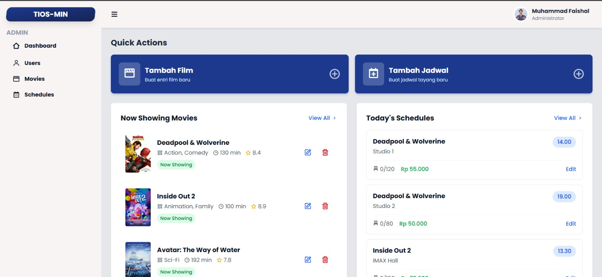
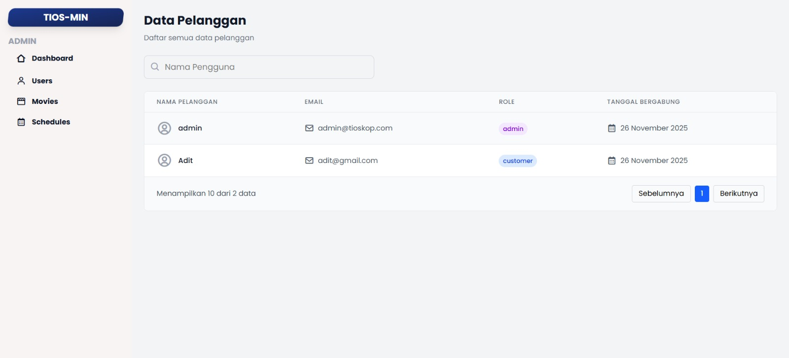
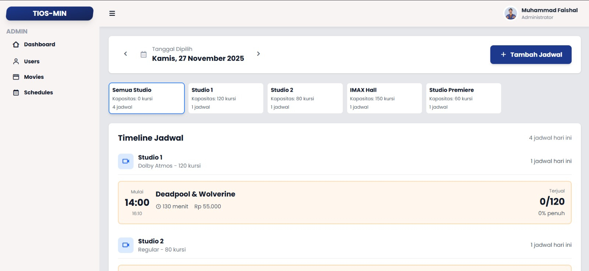

# **Tioskop – Sistem Pemesanan Tiket Bioskop 🎬**

**A Functional Programming Approach with Rust**

**Authors:**  
Kelompok 3 - Pemrograman Fungsional A  
Aditya Ridho Nugroho | Alief Rachmattul Islam | Arya Zaky Pradipta | Muhamad Faisal | Muhammad Fatwa Al Choiri

**Repository:** https://github.com/adityaridhon/Tioskop

---

## **Abstract**

Tioskop adalah aplikasi web berbasis Rust untuk pemesanan tiket bioskop yang menerapkan prinsip-prinsip pemrograman fungsional. Aplikasi ini dibangun menggunakan **Axum** sebagai web framework backend dan **Vue.js** untuk frontend, dengan **SeaORM** sebagai Object-Relational Mapping untuk interaksi database MySQL. 

Proyek ini mengimplementasikan konsep-konsep functional programming seperti **immutability**, **pure functions**, **higher-order functions**, **pattern matching**, dan **error handling** melalui sistem tipe yang kuat (Result/Option types). Backend menggunakan **async/await** dengan Tokio runtime untuk concurrent request handling, dan menerapkan **ownership & borrowing** sebagai memory safety guarantee tanpa garbage collector.

Fitur utama meliputi: pencarian film, melihat jadwal tayang per bioskop, pemilihan kursi interaktif, dan sistem booking dengan konfirmasi pembayaran. Aplikasi ini mendemonstrasikan bagaimana paradigma functional programming dapat menghasilkan kode yang lebih aman, maintainable, dan performant dalam konteks real-world web application.

---

## **Introduction**

### **Motivation**

Di era digital saat ini, pemesanan tiket bioskop masih sering dilakukan secara manual atau melalui sistem yang kompleks dan tidak user-friendly. Kami mengembangkan **Tioskop** untuk menyederhanakan proses booking tiket dengan interface yang intuitif dan backend yang robust.

### **Why Rust?**

Kami memilih **Rust** karena:

1. **Memory Safety tanpa Garbage Collection** - Ownership system mencegah data races dan memory leaks pada compile-time
2. **High Performance** - Performa setara dengan C/C++, cocok untuk web backend yang handle concurrent requests
3. **Strong Type System** - Type safety mencegah banyak bug pada compile-time
4. **Excellent Async Support** - Tokio runtime memberikan concurrency yang efisien
5. **Modern Tooling** - Cargo, Clippy, dan Rustfmt mempermudah development

### **Why Functional Programming?**

Functional programming memberikan benefits:

- **Predictability** - Pure functions dengan immutable data mengurangi side effects
- **Testability** - Isolated functions lebih mudah di-test
- **Composability** - Higher-order functions memungkinkan code reuse yang elegant
- **Error Handling** - Result/Option types memaksa explicit error handling
- **Concurrency** - Immutability mengurangi race conditions

### **Unique Features**

- **Type-Safe Database Queries** dengan SeaORM compile-time verification
- **Zero-Cost Abstractions** - High-level code tanpa runtime overhead
- **Async/Await Pattern** - Non-blocking I/O untuk scalability
- **Pattern Matching** - Exhaustive error handling
- **Ownership System** - No dangling pointers, no null references

---

## **Background and Concepts**

### **Technology Stack**

#### **Backend:**
- **Rust** (Edition 2021) - Systems programming language
- **Axum 0.8.7** - Ergonomic web framework built on Tokio
- **SeaORM** - Async ORM dengan compile-time query verification
- **Tokio 1.48.0** - Async runtime untuk concurrent I/O
- **Tower-HTTP 0.6.6** - Middleware (CORS, logging)
- **Serde 1.0** - Serialization/deserialization framework
- **Chrono 0.4** - Date and time handling
- **Rust Decimal 1.39** - Precise decimal arithmetic untuk currency

#### **Database:**
- **MySQL 8.0** - Relational database
- **Connection Pool** - Managed by SeaORM untuk efficient resource usage

#### **Frontend:**
- **Vue.js 3** - Progressive JavaScript framework
- **Vite** - Build tool dan dev server
- **Axios** - HTTP client untuk API calls
- **Vue Router** - Client-side routing

### **Key Functional Programming Concepts**

#### **1. Immutability**
```rust
// Default immutable
let booking_code = format!("BK{}", timestamp);
// booking_code = "new"; // ERROR: cannot assign twice

// Explicit mutable
let mut counter = 0;
counter += 1; // OK
```

#### **2. Pure Functions**
```rust
// Pure function: same input always produces same output, no side effects
fn calculate_total_price(seat_count: usize, price_per_seat: Decimal) -> Decimal {
    Decimal::from(seat_count) * price_per_seat
}
```

#### **3. Higher-Order Functions**
```rust
// Functions that take/return other functions
let movie_titles: Vec<String> = movies
    .into_iter()
    .filter(|m| m.genre == Some("Action".to_string()))
    .map(|m| m.title)
    .collect();
```

#### **4. Pattern Matching**
```rust
match MoviesEntity::find_by_id(id).one(&db).await {
    Ok(Some(movie)) => Ok(Json(ApiResponse::success(movie))),
    Ok(None) => Err(StatusCode::NOT_FOUND),
    Err(e) => {
        eprintln!("Database error: {}", e);
        Err(StatusCode::INTERNAL_SERVER_ERROR)
    }
}
```

#### **5. Error Handling with Result/Option Types**
```rust
// Result<T, E> forces error handling
async fn find_movie(id: i64) -> Result<Movie, DbErr> {
    MoviesEntity::find_by_id(id)
        .one(&db)
        .await?  // Propagate error
        .ok_or(DbErr::RecordNotFound("Movie not found".into()))
}
```

#### **6. Ownership & Borrowing**
```rust
// Ownership transfer
fn take_ownership(data: Vec<i32>) { /* data moved here */ }

// Borrowing (no ownership transfer)
fn borrow_data(data: &Vec<i32>) { /* data borrowed */ }

// Mutable borrowing
fn modify_data(data: &mut Vec<i32>) { data.push(4); }
```

#### **7. Type System & Generics**
```rust
// Generic response type
pub struct ApiResponse<T> {
    pub success: bool,
    pub data: Option<T>,
    pub message: Option<String>,
}

impl<T> ApiResponse<T> {
    pub fn success(data: T) -> Self {
        Self { success: true, data: Some(data), message: None }
    }
}
```

---

## **Source Code and Explanation**

### **Project Structure**

```
backend/
├── src/
│   ├── main.rs                 # Application entry point
│   ├── entities/               # Database entities (SeaORM models)
│   │   ├── mod.rs
│   │   ├── bookings.rs
│   │   ├── booking_seats.rs
│   │   ├── cinemas.rs
│   │   ├── movies.rs
│   │   ├── seats.rs
│   │   ├── showtimes.rs
│   │   ├── studios.rs
│   │   └── users.rs
│   ├── handlers/               # Request handlers
│   │   ├── mod.rs
│   │   ├── auth_handler.rs
│   │   ├── booking_handler.rs
│   │   ├── movie_handler.rs
│   │   ├── seat_handler.rs
│   │   ├── showtime_handler.rs
│   │   └── studio_handler.rs
│   ├── middleware/             # Custom middleware
│   │   ├── mod.rs
│   │   └── auth.rs
│   ├── models/                 # Request/Response models
│   │   ├── mod.rs
│   │   ├── auth.rs
│   │   ├── response.rs
│   │   └── user.rs
│   ├── routes/                 # Route definitions
│   │   ├── mod.rs
│   │   ├── auth_routes.rs
│   │   ├── booking_routes.rs
│   │   ├── movie_routes.rs
│   │   ├── seat_routes.rs
│   │   ├── showtime_routes.rs
│   │   ├── studio_routes.rs
│   │   └── workflow_routes.rs
│   └── services/               # Business logic
│       ├── mod.rs
│       ├── booking.rs
│       ├── movie.rs
│       ├── showtime.rs
│       └── workflow_service.rs
├── Cargo.toml                  # Dependencies
└── .env                        # Environment variables
```

---

### **1. Main Entry Point**

**File:** `backend/src/main.rs`

```rust
1   mod entities;
2   mod handlers;
3   mod middleware;
4   mod models;
5   mod routes;
6   mod services;
7   
8   use axum::Router;
9   use dotenvy::dotenv;
10  use routes::workflow_routes::AppState as WorkflowAppState;
11  use routes::{
12      auth_routes::auth_routes, 
13      booking_routes::booking_routes, 
14      movie_routes::movie_routes,
15      seat_routes::seat_routes, 
16      showtime_routes::showtime_routes, 
17      studio_routes::studio_routes,
18      workflow_routes::workflow_routes,
19  };
20  use sea_orm::Database;
21  use services::workflow_service::JadwalWorkflowService;
22  use std::net::SocketAddr;
23  use std::sync::Arc;
24  use tower_http::cors::{Any, CorsLayer};
25  
26  #[tokio::main]
27  async fn main() {
28      dotenv().ok();
29      
30      let database_url = std::env::var("DATABASE_URL")
31          .expect("DATABASE_URL must be set in .env file");
32  
33      let db = Database::connect(&database_url)
34          .await
35          .expect("Failed to connect to database");
36      
37      println!("Connected to database with SeaORM");
38  
39      let workflow_service = Arc::new(JadwalWorkflowService::new(db.clone()));
40      println!("Workflow service initialized");
41  
42      let cors = CorsLayer::new()
43          .allow_origin(Any)
44          .allow_methods(Any)
45          .allow_headers(Any);
46  
47      let workflow_state = WorkflowAppState {
48          db: db.clone(),
49          workflow_service: workflow_service.clone(),
50      };
51  
52      let app = Router::new()
53          .nest("/api/auth", auth_routes(db.clone()))
54          .nest("/api/movies", movie_routes(db.clone()))
55          .nest("/api/showtimes", showtime_routes(db.clone()))
56          .nest("/api/studios", studio_routes(db.clone()))
57          .nest("/api/seats", seat_routes(db.clone()))
58          .nest("/api/bookings", booking_routes(db.clone()))
59          .nest("/api/workflow", workflow_routes(workflow_state))
60          .layer(cors);
61  
62      println!("All routes configured with SeaORM\n");
63  
64      let addr = SocketAddr::from(([127, 0, 0, 1], 3000));
65      println!("Server running on http://{}", addr);
66  
67      let listener = tokio::net::TcpListener::bind(addr).await.unwrap();
68      axum::serve(listener, app).await.unwrap();
69  }
```

**Explanation:**

- **Lines 1-6**: Module declarations mengorganisir code berdasarkan responsibility
- **Lines 8-24**: Import statements untuk dependencies
- **Line 26**: `#[tokio::main]` - Macro yang men-transform async fn main menjadi sync entry point dengan Tokio runtime
- **Lines 28-31**: Load environment variables dari `.env` file
- **Lines 33-35**: Establish database connection pool dengan SeaORM
- **Line 39**: `Arc<T>` - Atomic Reference Counting untuk thread-safe shared ownership
- **Lines 42-45**: Configure CORS middleware untuk allow cross-origin requests
- **Lines 47-50**: Create workflow state dengan database connection dan service
- **Lines 52-60**: Compose router dengan nested routes dan CORS layer
- **Lines 64-68**: Bind server ke address dan start listening

**Functional Programming Principles:**
- **Immutability**: Semua bindings immutable by default (lines 30, 33, 39, 42, 47, 52, 64)
- **Composition**: Router composition dengan `.nest()` method (lines 53-59)
- **Error Handling**: `.expect()` untuk explicit error messages (lines 31, 35)

---

### **2. Database Entities**

#### **Movies Entity**

**File:** `backend/src/entities/movies.rs`

```rust
1   use sea_orm::entity::prelude::*;
2   use serde::{Deserialize, Serialize};
3   
4   #[derive(Clone, Debug, PartialEq, DeriveEntityModel, Serialize, Deserialize)]
5   #[sea_orm(table_name = "movies")]
6   pub struct Model {
7       #[sea_orm(primary_key)]
8       pub id: i64,
9       pub title: String,
10      pub genre: Option<String>,
11      pub rating: Option<String>,
12      pub duration: Option<i32>,
13      pub description: Option<String>,
14      pub poster_url: Option<String>,
15      pub release_date: Option<chrono::NaiveDate>,
16      pub created_at: Option<chrono::DateTime<chrono::Utc>>,
17  }
18  
19  #[derive(Copy, Clone, Debug, EnumIter, DeriveRelation)]
20  pub enum Relation {
21      #[sea_orm(has_many = "super::showtimes::Entity")]
22      Showtimes,
23  }
24  
25  impl Related<super::showtimes::Entity> for Entity {
26      fn to() -> RelationDef {
27          Relation::Showtimes.def()
28      }
29  }
30  
31  impl ActiveModelBehavior for ActiveModel {}
```

**Explanation:**

- **Lines 1-2**: Import SeaORM prelude dan serde untuk serialization
- **Lines 4-5**: Derive macros untuk automatic trait implementation
  - `Clone`: Enable cloning
  - `Debug`: Enable debug formatting
  - `PartialEq`: Enable equality comparison
  - `DeriveEntityModel`: Generate entity, column, and primary key types
  - `Serialize/Deserialize`: JSON conversion
- **Line 5**: Attribute macro specifying database table name
- **Lines 6-17**: Model struct representing database schema
  - **Line 8**: Primary key dengan type `i64`
  - **Line 9**: Required field (no Option wrapper)
  - **Lines 10-16**: Optional fields dengan `Option<T>` untuk nullable columns
- **Lines 19-23**: Relation enum defining relationships dengan entities lain
- **Line 21**: `has_many` relationship - one movie has many showtimes
- **Lines 25-29**: Implementation untuk accessing related showtimes
- **Line 31**: Empty implementation untuk ActiveModelBehavior (hooks untuk lifecycle events)

**Functional Programming Principles:**
- **Type Safety**: Explicit `Option<T>` untuk nullable fields (no null references)
- **Immutability**: All fields are immutable by default
- **Pure Functions**: Relation methods are pure (no side effects)
- **Derive Macros**: Code generation untuk reduce boilerplate (DRY principle)

---

#### **Bookings Entity**

**File:** `backend/src/entities/bookings.rs`

```rust
1   use rust_decimal::Decimal;
2   use sea_orm::entity::prelude::*;
3   use serde::{Deserialize, Serialize};
4   
5   #[derive(Clone, Debug, PartialEq, DeriveEntityModel, Serialize, Deserialize)]
6   #[sea_orm(table_name = "bookings")]
7   pub struct Model {
8       #[sea_orm(primary_key)]
9       pub id: i64,
10      pub user_id: i64,
11      pub showtime_id: i64,
12      pub booking_code: String,
13      pub total_price: Decimal,
14      pub payment_status: String,
15      pub created_at: Option<chrono::DateTime<chrono::Utc>>,
16  }
17  
18  #[derive(Copy, Clone, Debug, EnumIter, DeriveRelation)]
19  pub enum Relation {
20      #[sea_orm(
21          belongs_to = "super::users::Entity",
22          from = "Column::UserId",
23          to = "super::users::Column::Id"
24      )]
25      Users,
26      #[sea_orm(
27          belongs_to = "super::showtimes::Entity",
28          from = "Column::ShowtimeId",
29          to = "super::showtimes::Column::Id"
30      )]
31      Showtimes,
32      #[sea_orm(has_many = "super::booking_seats::Entity")]
33      BookingSeats,
34  }
35  
36  impl Related<super::users::Entity> for Entity {
37      fn to() -> RelationDef {
38          Relation::Users.def()
39      }
40  }
41  
42  impl Related<super::showtimes::Entity> for Entity {
43      fn to() -> RelationDef {
44          Relation::Showtimes.def()
45      }
46  }
47  
48  impl Related<super::booking_seats::Entity> for Entity {
49      fn to() -> RelationDef {
50          Relation::BookingSeats.def()
51      }
52  }
53  
54  impl ActiveModelBehavior for ActiveModel {}
```

**Explanation:**

- **Line 1**: Import `Decimal` type untuk precise decimal arithmetic (avoid floating point errors)
- **Line 13**: `Decimal` type untuk currency values (more accurate than `f64` for money)
- **Lines 20-25**: `belongs_to` relationship - booking belongs to one user
  - **Line 22**: Foreign key column di table ini
  - **Line 23**: Referenced column di table users
- **Lines 26-31**: `belongs_to` relationship - booking belongs to one showtime
- **Line 32**: `has_many` relationship - one booking has many booking_seats
- **Lines 36-52**: Implementation untuk accessing related entities via type-safe methods

**Functional Programming Principles:**
- **Precise Arithmetic**: `Decimal` type prevents floating point errors
- **Type-Safe Relations**: Compile-time verified foreign key relationships
- **Immutable Data**: All fields are immutable by default

---

#### **Seats Entity**

**File:** `backend/src/entities/seats.rs`

```rust
1   use sea_orm::entity::prelude::*;
2   use serde::{Deserialize, Serialize};
3   
4   #[derive(Clone, Debug, PartialEq, DeriveEntityModel, Serialize, Deserialize)]
5   #[sea_orm(table_name = "seats")]
6   pub struct Model {
7       #[sea_orm(primary_key)]
8       pub id: i64,
9       pub studio_id: i64,
10      pub seat_code: String,
11      pub seat_row: i32,
12      pub seat_col: i32,
13      pub seat_status: String,
14  }
15  
16  #[derive(Copy, Clone, Debug, EnumIter, DeriveRelation)]
17  pub enum Relation {
18      #[sea_orm(
19          belongs_to = "super::studios::Entity",
20          from = "Column::StudioId",
21          to = "super::studios::Column::Id"
22      )]
23      Studios,
24      #[sea_orm(has_many = "super::booking_seats::Entity")]
25      BookingSeats,
26  }
27  
28  impl Related<super::studios::Entity> for Entity {
29      fn to() -> RelationDef {
30          Relation::Studios.def()
31      }
32  }
33  
34  impl Related<super::booking_seats::Entity> for Entity {
35      fn to() -> RelationDef {
36          Relation::BookingSeats.def()
37      }
38  }
39  
40  impl ActiveModelBehavior for ActiveModel {}
```

**Explanation:**

- **Lines 10-12**: Seat identification fields
  - `seat_code`: Human-readable code (e.g., "A1", "B5")
  - `seat_row`: Row number
  - `seat_col`: Column number
- **Line 13**: Seat status (e.g., "AVAILABLE", "BROKEN")
- **Lines 18-23**: `belongs_to` relationship - seat belongs to one studio
- **Line 24**: `has_many` relationship - one seat can be in many booking_seats (historical bookings)

---

#### **Showtimes Entity**

**File:** `backend/src/entities/showtimes.rs`

```rust
1   use rust_decimal::Decimal;
2   use sea_orm::entity::prelude::*;
3   use serde::{Deserialize, Serialize};
4   
5   #[derive(Clone, Debug, PartialEq, DeriveEntityModel, Serialize, Deserialize)]
6   #[sea_orm(table_name = "showtimes")]
7   pub struct Model {
8       #[sea_orm(primary_key)]
9       pub id: i64,
10      pub movie_id: i64,
11      pub studio_id: i64,
12      pub start_time: chrono::DateTime<chrono::Utc>,
13      pub price: Decimal,
14  }
15  
16  #[derive(Copy, Clone, Debug, EnumIter, DeriveRelation)]
17  pub enum Relation {
18      #[sea_orm(
19          belongs_to = "super::movies::Entity",
20          from = "Column::MovieId",
21          to = "super::movies::Column::Id"
22      )]
23      Movies,
24      #[sea_orm(
25          belongs_to = "super::studios::Entity",
26          from = "Column::StudioId",
27          to = "super::studios::Column::Id"
28      )]
29      Studios,
30      #[sea_orm(has_many = "super::bookings::Entity")]
31      Bookings,
32  }
33  
34  impl Related<super::movies::Entity> for Entity {
35      fn to() -> RelationDef {
36          Relation::Movies.def()
37      }
38  }
39  
40  impl Related<super::studios::Entity> for Entity {
41      fn to() -> RelationDef {
42          Relation::Studios.def()
43      }
44  }
45  
46  impl Related<super::bookings::Entity> for Entity {
47      fn to() -> RelationDef {
48          Relation::Bookings.def()
49      }
50  }
51  
52  impl ActiveModelBehavior for ActiveModel {}
```

**Explanation:**

- **Line 12**: `chrono::DateTime<Utc>` for timezone-aware timestamp
- **Line 13**: `Decimal` type untuk price (currency)
- **Lines 18-23**: Showtime belongs to one movie
- **Lines 24-29**: Showtime belongs to one studio
- **Line 30**: One showtime has many bookings

---

### **3. API Handlers**

#### **Movie Handler**

**File:** `backend/src/handlers/movie_handler.rs`

```rust
1   use crate::{
2       entities::movies::{self, Entity as MoviesEntity},
3       models::response::ApiResponse,
4   };
5   use axum::{
6       extract::{Path, Query, State},
7       http::StatusCode,
8       Json,
9   };
10  use sea_orm::{
11      ActiveModelTrait, ColumnTrait, DatabaseConnection, EntityTrait, IntoActiveModel, QueryFilter,
12      Set,
13  };
14  use serde::{Deserialize, Serialize};
15  use std::collections::HashMap;
16  
17  #[derive(Debug, Deserialize)]
18  pub struct CreateMovieRequest {
19      pub title: String,
20      pub genre: Option<String>,
21      pub rating: Option<String>,
22      pub duration: Option<i32>,
23      pub description: Option<String>,
24      pub poster_url: Option<String>,
25      pub release_date: Option<String>,
26  }
27  
28  pub async fn get_all_movies(
29      State(db): State<DatabaseConnection>,
30  ) -> Result<Json<ApiResponse<Vec<movies::Model>>>, StatusCode> {
31      match MoviesEntity::find().all(&db).await {
32          Ok(movies) => Ok(Json(ApiResponse::success(movies))),
33          Ok(None) => Err(StatusCode::NOT_FOUND),
34          Err(e) => {
35              eprintln!("Database error: {}", e);
36              Err(StatusCode::INTERNAL_SERVER_ERROR)
37          }
38      }
39  }
40  
41  pub async fn get_movie_by_id(
42      State(db): State<DatabaseConnection>,
43      Path(id): Path<i64>,
44  ) -> Result<Json<ApiResponse<movies::Model>>, StatusCode> {
45      match MoviesEntity::find_by_id(id).one(&db).await {
46          Ok(Some(movie)) => Ok(Json(ApiResponse::success(movie))),
47          Ok(None) => Err(StatusCode::NOT_FOUND),
48          Err(e) => {
49              eprintln!("Database error: {}", e);
50              Err(StatusCode::INTERNAL_SERVER_ERROR)
51          }
52      }
53  }
54  
55  pub async fn search_movies(
56      State(db): State<DatabaseConnection>,
57      Query(params): Query<HashMap<String, String>>,
58  ) -> Result<Json<ApiResponse<Vec<movies::Model>>>, StatusCode> {
59      let search_query = params.get("q").map(|s| s.as_str()).unwrap_or("");
60  
61      match MoviesEntity::find()
62          .filter(movies::Column::Title.contains(search_query))
63          .all(&db)
64          .await
65      {
66          Ok(movies) => Ok(Json(ApiResponse::success(movies))),
67          Ok(None) => Err(StatusCode::NOT_FOUND),
68          Err(e) => {
69              eprintln!("Database error: {}", e);
70              Err(StatusCode::INTERNAL_SERVER_ERROR)
71          }
72      }
73  }
74  
75  pub async fn create_movie(
76      State(db): State<DatabaseConnection>,
77      Json(payload): Json<CreateMovieRequest>,
78  ) -> Result<Json<ApiResponse<movies::Model>>, StatusCode> {
79      let release_date = payload.release_date.and_then(|date_str| {
80          chrono::NaiveDate::parse_from_str(&date_str, "%Y-%m-%d").ok()
81      });
82  
83      let movie = movies::ActiveModel {
84          title: Set(payload.title),
85          genre: Set(payload.genre),
86          rating: Set(payload.rating),
87          duration: Set(payload.duration),
88          description: Set(payload.description),
89          poster_url: Set(payload.poster_url),
90          release_date: Set(release_date),
91          ..Default::default()
92      };
93  
94      match movie.insert(&db).await {
95          Ok(inserted_movie) => Ok(Json(ApiResponse::success(inserted_movie))),
96          Err(e) => {
97              eprintln!("Database error: {}", e);
98              Err(StatusCode::INTERNAL_SERVER_ERROR)
99          }
100     }
101 }
102 
103 pub async fn update_movie(
104     State(db): State<DatabaseConnection>,
105     Path(id): Path<i64>,
106     Json(payload): Json<CreateMovieRequest>,
107 ) -> Result<Json<ApiResponse<movies::Model>>, StatusCode> {
108     let movie = match MoviesEntity::find_by_id(id).one(&db).await {
109         Ok(Some(m)) => m,
110         Ok(None) => return Err(StatusCode::NOT_FOUND),
111         Err(e) => {
112             eprintln!("Database error: {}", e);
113             return Err(StatusCode::INTERNAL_SERVER_ERROR);
114         }
115     };
116 
117     let release_date = payload.release_date.and_then(|date_str| {
118         chrono::NaiveDate::parse_from_str(&date_str, "%Y-%m-%d").ok()
119     });
120 
121     let mut active_movie: movies::ActiveModel = movie.into_active_model();
122     active_movie.title = Set(payload.title);
123     active_movie.genre = Set(payload.genre);
124     active_movie.rating = Set(payload.rating);
125     active_movie.duration = Set(payload.duration);
126     active_movie.description = Set(payload.description);
127     active_movie.poster_url = Set(payload.poster_url);
128     active_movie.release_date = Set(release_date);
129 
130     match active_movie.update(&db).await {
131         Ok(updated_movie) => Ok(Json(ApiResponse::success(updated_movie))),
132         Err(e) => {
133             eprintln!("Database error: {}", e);
134             Err(StatusCode::INTERNAL_SERVER_ERROR)
135         }
136     }
137 }
138 
139 pub async fn delete_movie(
140     State(db): State<DatabaseConnection>,
141     Path(id): Path<i64>,
142 ) -> Result<StatusCode, StatusCode> {
143     match MoviesEntity::delete_by_id(id).exec(&db).await {
144         Ok(result) if result.rows_affected > 0 => Ok(StatusCode::NO_CONTENT),
145         Ok(_) => Err(StatusCode::NOT_FOUND),
146         Err(e) => {
147             eprintln!("Database error: {}", e);
148             Err(StatusCode::INTERNAL_SERVER_ERROR)
149         }
150     }
151 }
```

**Explanation:**

**Lines 17-26: Request DTO (Data Transfer Object)**
- Struct untuk deserialize JSON request body
- `Option<T>` untuk optional fields

**Lines 28-39: Get All Movies Handler**
- **Line 29**: `State(db)` - Extract database connection dari application state
- **Line 30**: Return type `Result<Json<...>, StatusCode>` untuk error handling
- **Line 31**: Async database query dengan `.await`
- **Lines 31-38**: Pattern matching untuk exhaustive error handling
  - `Ok(movies)` - Success case, wrap dalam ApiResponse
  - `Ok(None)` - No results found
  - `Err(e)` - Database error

**Lines 41-53: Get Movie by ID**
- **Line 43**: `Path(id)` - Extract ID dari URL path parameter
- **Line 45**: `find_by_id()` - Type-safe query dengan primary key
- **Line 46**: `Ok(Some(movie))` - Nested Option dalam Result

**Lines 55-73: Search Movies**
- **Line 57**: `Query(params)` - Extract query parameters dari URL
- **Line 59**: Higher-order function `.map()` dengan closure
- **Line 59**: `.unwrap_or("")` - Default value jika None
- **Line 62**: `.filter()` - Type-safe WHERE clause
- **Line 62**: `.contains()` - SQL LIKE operation

**Lines 75-101: Create Movie**
- **Line 77**: `Json(payload)` - Deserialize JSON body ke struct
- **Lines 79-81**: `.and_then()` - Monad chaining untuk Option<T>
  - Transform Option<String> ke Option<NaiveDate>
  - `.ok()` convert Result ke Option (discard error)
- **Lines 83-92**: Create ActiveModel dengan `Set()` wrapper
- **Line 91**: `..Default::default()` - Fill remaining fields dengan default
- **Line 94**: `.insert()` - Execute INSERT query

**Lines 103-137: Update Movie**
- **Lines 108-115**: Fetch existing movie first
- **Line 110**: Early return dengan `return Err(...)`
- **Line 121**: Convert Model ke ActiveModel (untuk update)
- **Line 121**: `mut` keyword karena akan modify fields
- **Lines 122-128**: Update individual fields dengan `Set()`
- **Line 130**: `.update()` - Execute UPDATE query

**Lines 139-151: Delete Movie**
- **Line 143**: `.delete_by_id()` - Type-safe DELETE operation
- **Line 144**: Guard condition `if result.rows_affected > 0`
- **Line 144**: Success returns `StatusCode::NO_CONTENT` (204)
- **Line 145**: No rows deleted returns `NOT_FOUND` (404)

**Functional Programming Principles:**
- **Immutability**: Semua bindings immutable except line 121 (`mut active_movie`)
- **Pattern Matching**: Exhaustive error handling (lines 31-38, 45-52, 61-72, etc.)
- **Higher-Order Functions**: `.map()`, `.filter()`, `.and_then()` (lines 59, 62, 79)
- **Result Type**: Explicit error handling, no exceptions
- **Option Type**: Safe handling of nullable values (lines 46, 59, 79-81)
- **Type Safety**: Compile-time verified queries

---

#### **Booking Handler**

**File:** `backend/src/handlers/booking_handler.rs`

```rust
1   use crate::{
2       entities::{
3           booking_seats::{self, Entity as BookingSeatsEntity},
4           bookings::{self, Entity as BookingsEntity},
5           seats::{self, Entity as SeatsEntity},
6           showtimes::{self, Entity as ShowtimesEntity},
7       },
8       models::response::ApiResponse,
9   };
10  use axum::{extract::State, http::StatusCode, Json};
11  use chrono::Utc;
12  use rust_decimal::Decimal;
13  use sea_orm::{
14      ActiveModelTrait, ColumnTrait, DatabaseConnection, EntityTrait, IntoActiveModel, QueryFilter,
15      Set, TransactionTrait,
16  };
17  use serde::{Deserialize, Serialize};
18  
19  #[derive(Debug, Deserialize)]
20  pub struct CreateBookingRequest {
21      pub user_id: i64,
22      pub showtime_id: i64,
23      pub seat_ids: Vec<i64>,
24  }
25  
26  #[derive(Debug, Serialize)]
27  pub struct BookingResponse {
28      pub booking_id: i64,
29      pub booking_code: String,
30      pub total_price: String,
31      pub seats: Vec<String>,
32  }
33  
34  pub async fn create_booking(
35      State(db): State<DatabaseConnection>,
36      Json(payload): Json<CreateBookingRequest>,
37  ) -> Result<Json<ApiResponse<BookingResponse>>, StatusCode> {
38      if payload.seat_ids.is_empty() {
39          return Err(StatusCode::BAD_REQUEST);
40      }
41  
42      let txn = db.begin().await.map_err(|e| {
43          eprintln!("Transaction error: {}", e);
44          StatusCode::INTERNAL_SERVER_ERROR
45      })?;
46  
47      let showtime = ShowtimesEntity::find_by_id(payload.showtime_id)
48          .one(&txn)
49          .await
50          .map_err(|e| {
51              eprintln!("Database error: {}", e);
52              StatusCode::INTERNAL_SERVER_ERROR
53          })?
54          .ok_or(StatusCode::NOT_FOUND)?;
55  
56      let seats = SeatsEntity::find()
57          .filter(seats::Column::Id.is_in(payload.seat_ids.clone()))
58          .all(&txn)
59          .await
60          .map_err(|e| {
61              eprintln!("Database error: {}", e);
62              StatusCode::INTERNAL_SERVER_ERROR
63          })?;
64  
65      if seats.len() != payload.seat_ids.len() {
66          txn.rollback().await.ok();
67          return Err(StatusCode::BAD_REQUEST);
68      }
69  
70      let booking_code = format!("BK{}", Utc::now().timestamp());
71      let total_price = showtime.price * Decimal::from(seats.len());
72  
73      let booking = bookings::ActiveModel {
74          user_id: Set(payload.user_id),
75          showtime_id: Set(payload.showtime_id),
76          booking_code: Set(booking_code.clone()),
77          total_price: Set(total_price),
78          payment_status: Set("PENDING".to_string()),
79          ..Default::default()
80      };
81  
82      let inserted_booking = booking.insert(&txn).await.map_err(|e| {
83          eprintln!("Insert error: {}", e);
84          StatusCode::INTERNAL_SERVER_ERROR
85      })?;
86  
87      for seat in &seats {
88          let booking_seat = booking_seats::ActiveModel {
89              booking_id: Set(inserted_booking.id),
90              seat_id: Set(seat.id),
91              price: Set(showtime.price),
92              ..Default::default()
93          };
94  
95          booking_seat.insert(&txn).await.map_err(|e| {
96              eprintln!("Insert error: {}", e);
97              StatusCode::INTERNAL_SERVER_ERROR
98          })?;
99      }
100 
101     txn.commit().await.map_err(|e| {
102         eprintln!("Commit error: {}", e);
103         StatusCode::INTERNAL_SERVER_ERROR
104     })?;
105 
106     let response = BookingResponse {
107         booking_id: inserted_booking.id,
108         booking_code,
109         total_price: total_price.to_string(),
110         seats: seats.iter().map(|s| s.seat_code.clone()).collect(),
111     };
112 
113     Ok(Json(ApiResponse::success(response)))
114 }
115 
116 pub async fn get_bookings(
117     State(db): State<DatabaseConnection>,
118 ) -> Result<Json<ApiResponse<Vec<bookings::Model>>>, StatusCode> {
119     match BookingsEntity::find().all(&db).await {
120         Ok(bookings) => Ok(Json(ApiResponse::success(bookings))),
121         Err(e) => {
122             eprintln!("Database error: {}", e);
123             Err(StatusCode::INTERNAL_SERVER_ERROR)
124         }
125     }
126 }
```

**Explanation:**

**Lines 19-24: Request DTO**
- `seat_ids: Vec<i64>` - Array of seat IDs to book

**Lines 26-32: Response DTO**
- Custom response structure dengan computed fields

**Lines 34-114: Create Booking Handler (Complex Transaction)**

**Line 38-40**: Input validation
- Early return jika seat_ids empty

**Lines 42-45**: Begin database transaction
- `.begin()` - Start transaction
- `.map_err()` - Transform error type dari `DbErr` ke `StatusCode`
- `?` operator - Propagate error if failed

**Lines 47-54**: Fetch showtime
- Query executed within transaction (`&txn`)
- Chained error handling:
  - `.await` - Wait for async operation
  - `.map_err()` - Handle database error
  - `?` - Propagate error
  - `.ok_or()` - Convert `Option<T>` to `Result<T, E>`

**Lines 56-63**: Fetch seats
- `.is_in()` - SQL IN clause (WHERE id IN (...))
- `.clone()` - Clone seat_ids karena ownership

**Lines 65-68**: Validate all seats exist
- If count mismatch, rollback transaction
- Atomicity guarantee - all or nothing

**Line 70**: Generate booking code
- `format!()` macro untuk string interpolation
- `Utc::now().timestamp()` - Current Unix timestamp

**Line 71**: Calculate total price
- `Decimal::from()` - Safe conversion
- Precise multiplication (no floating point error)

**Lines 73-80**: Create booking ActiveModel
- `Set()` wrapper marks field for insertion
- `.clone()` karena booking_code akan digunakan lagi
- `..Default::default()` - Auto-generate other fields (id, timestamps)

**Lines 82-85**: Insert booking
- Execute INSERT within transaction
- `.map_err()` convert error
- `?` propagate error

**Lines 87-99**: Insert booking seats (loop)
- **Line 87**: `&seats` - Immutable borrow (tidak consume seats)
- **Lines 88-93**: Create ActiveModel untuk each seat
- **Lines 95-98**: Insert each booking_seat
- If any insert fails, entire transaction rolls back

**Lines 101-104**: Commit transaction
- Only commits if all operations succeeded
- Atomicity guarantee

**Lines 106-111**: Build response
- **Line 110**: Higher-order function chain:
  - `.iter()` - Create iterator
  - `.map(|s| s.seat_code.clone())` - Transform each seat to code
  - `.collect()` - Collect into Vec<String>

**Lines 116-126: Get All Bookings**
- Simple read operation (no transaction needed)

**Functional Programming Principles:**
- **Transaction Atomicity**: All operations succeed or none (lines 42-104)
- **Error Propagation**: `?` operator untuk clean error handling
- **Higher-Order Functions**: `.map()`, `.iter()`, `.collect()` (line 110)
- **Immutability**: Most bindings immutable
- **Type Safety**: `Decimal` untuk currency arithmetic (line 71)
- **Pattern Matching**: Exhaustive error cases (lines 119-125)

---

### **4. Business Logic Services**

#### **Workflow Service**

**File:** `backend/src/services/workflow_service.rs`

```rust
1   use crate::entities::{
2       cinemas::{self, Entity as CinemasEntity},
3       movies::{self, Entity as MoviesEntity},
4       showtimes::{self, Entity as ShowtimesEntity},
5       studios::{self, Entity as StudiosEntity},
6   };
7   use chrono::{DateTime, Utc};
8   use sea_orm::{ColumnTrait, DatabaseConnection, EntityTrait, QueryFilter, QueryOrder};
9   use serde::{Deserialize, Serialize};
10  use std::collections::HashMap;
11  
12  #[derive(Debug, Clone, Serialize, Deserialize)]
13  pub struct JadwalTerdekat {
14      pub showtime_id: i64,
15      pub movie_id: i64,
16      pub movie_title: String,
17      pub movie_poster: Option<String>,
18      pub cinema_name: String,
19      pub studio_name: String,
20      pub start_time: DateTime<Utc>,
21      pub price: String,
22  }
23  
24  pub struct JadwalWorkflowService {
25      db: DatabaseConnection,
26  }
27  
28  impl JadwalWorkflowService {
29      pub fn new(db: DatabaseConnection) -> Self {
30          Self { db }
31      }
32  
33      pub async fn execute_workflow(&self) -> Result<Vec<JadwalTerdekat>, sea_orm::DbErr> {
34          let now = Utc::now();
35  
36          let showtimes = ShowtimesEntity::find()
37              .filter(showtimes::Column::StartTime.gte(now))
38              .order_by_asc(showtimes::Column::StartTime)
39              .all(&self.db)
40              .await?;
41  
42          let mut results = Vec::new();
43  
44          for showtime in showtimes {
45              let movie = MoviesEntity::find_by_id(showtime.movie_id)
46                  .one(&self.db)
47                  .await?;
48  
49              let studio = StudiosEntity::find_by_id(showtime.studio_id)
50                  .one(&self.db)
51                  .await?;
52  
53              if let (Some(movie), Some(studio)) = (movie, studio) {
54                  let cinema = CinemasEntity::find_by_id(studio.cinema_id)
55                      .one(&self.db)
56                      .await?;
57  
58                  if let Some(cinema) = cinema {
59                      results.push(JadwalTerdekat {
60                          showtime_id: showtime.id,
61                          movie_id: movie.id,
62                          movie_title: movie.title,
63                          movie_poster: movie.poster_url,
64                          cinema_name: cinema.name,
65                          studio_name: studio.name,
66                          start_time: showtime.start_time,
67                          price: showtime.price.to_string(),
68                      });
69                  }
70              }
71          }
72  
73          Ok(results)
74      }
75  }
```

**Explanation:**

**Lines 12-22: Response DTO**
- Aggregated data dari multiple tables
- Flattened structure untuk easy frontend consumption

**Lines 24-26: Service Struct**
- Holds database connection
- Encapsulates business logic

**Lines 28-31: Constructor**
- `new()` - Associated function (like static method)
- Returns `Self` (same as returning `JadwalWorkflowService`)

**Lines 33-74: Execute Workflow (Main Business Logic)**

**Line 34**: Get current time
- `Utc::now()` - Timezone-aware timestamp

**Lines 36-40**: Query future showtimes
- **Line 37**: `.filter()` - WHERE clause (start_time >= now)
- **Line 37**: `.gte()` - Greater than or equal operator
- **Line 38**: `.order_by_asc()` - ORDER BY ascending
- **Line 39**: `.all()` - Fetch all results
- **Line 40**: `?` - Propagate error if query fails

**Line 42**: Initialize results vector
- `mut` karena akan di-push

**Lines 44-71**: Process each showtime
- **Line 44**: For loop over showtimes

**Lines 45-47**: Fetch related movie
- **Line 45**: `find_by_id()` - Type-safe query
- **Line 46**: `.one()` - Fetch single result (returns `Option<Model>`)
- **Line 47**: `?` - Propagate error

**Lines 49-51**: Fetch related studio
- Same pattern as movie query

**Line 53**: Pattern matching dengan tuple destructuring
- `if let (Some(movie), Some(studio)) = (movie, studio)`
- Only proceed if both movie and studio exist
- Pattern matching untuk safe unwrapping

**Lines 54-56**: Fetch related cinema
- Nested query

**Lines 58-69**: Build result if cinema exists
- **Line 59**: `.push()` - Add to results vector
- **Lines 59-68**: Construct JadwalTerdekat struct
- **Line 67**: `.to_string()` - Convert Decimal to String

**Line 73**: Return results
- `Ok(results)` - Wrap dalam Result type

**Functional Programming Principles:**
- **Pure Business Logic**: No side effects (hanya data transformation)
- **Composition**: Complex query dari multiple simple queries
- **Async/Await**: Non-blocking concurrent operations
- **Result Type**: Explicit error handling with `?` operator
- **Pattern Matching**: Safe unwrapping dengan `if let` (line 53, 58)
- **Immutability**: Most bindings immutable (except `results` yang perlu mut untuk push)

---

### **5. Middleware & Authentication**

#### **Auth Middleware**

**File:** `backend/src/middleware/auth.rs`

```rust
1   use crate::models::user::Claims;
2   use axum::{
3       extract::Request,
4       http::{header, StatusCode},
5       middleware::Next,
6       response::Response,
7   };
8   
9   pub async fn auth_middleware(mut req: Request, next: Next) -> Result<Response, StatusCode> {
10      let auth_header = req
11          .headers()
12          .get(header::AUTHORIZATION)
13          .and_then(|h| h.to_str().ok());
14  
15      let token = match auth_header {
16          Some(header) if header.starts_with("Bearer ") => {
17              header.trim_start_matches("Bearer ")
18          }
19          _ => return Err(StatusCode::UNAUTHORIZED),
20      };
21  
22      let secret = std::env::var("JWT_SECRET").unwrap_or_else(|_| "secret_key".to_string());
23  
24      match jsonwebtoken::decode::<Claims>(
25          token,
26          &jsonwebtoken::DecodingKey::from_secret(secret.as_bytes()),
27          &jsonwebtoken::Validation::default(),
28      ) {
29          Ok(token_data) => {
30              req.extensions_mut().insert(token_data.claims.user_id);
31              Ok(next.run(req).await)
32          }
33          Err(_) => Err(StatusCode::UNAUTHORIZED),
34      }
35  }
```

**Explanation:**

**Line 9: Middleware Function Signature**
- `mut req: Request` - Mutable request (akan di-modify)
- `next: Next` - Next middleware/handler di chain
- Returns `Result<Response, StatusCode>`

**Lines 10-13: Extract Authorization Header**
- **Line 11**: `.headers()` - Get HTTP headers
- **Line 12**: `.get(header::AUTHORIZATION)` - Get specific header
- **Line 13**: `.and_then()` - Monad chaining
  - Transform `Option<&HeaderValue>` ke `Option<&str>`
  - `.ok()` discard error dari `.to_str()`

**Lines 15-20: Extract Bearer Token**
- **Line 15**: Pattern matching on auth_header
- **Line 16**: Guard condition `if header.starts_with("Bearer ")`
  - Matches only if header exists AND starts with "Bearer "
- **Line 17**: Remove "Bearer " prefix
- **Line 19**: Wildcard pattern `_` - No auth or invalid format

**Line 22: Get JWT Secret**
- `.unwrap_or_else()` - Lazy default value
- Closure `|_| "secret_key".to_string()` hanya executed jika Err

**Lines 24-28: Decode JWT**
- **Line 24**: `decode::<Claims>` - Generic function dengan explicit type
- **Line 25**: Token string
- **Line 26**: Decoding key dari secret bytes
- **Line 27**: Default validation rules

**Lines 29-32: Success Case**
- **Line 30**: `.extensions_mut()` - Mutable access to request extensions
- **Line 30**: `.insert()` - Store user_id for downstream handlers
- **Line 31**: `next.run(req).await` - Continue to next handler

**Line 33: Error Case**
- Return `UNAUTHORIZED` status if decode fails

**Functional Programming Principles:**
- **Higher-Order Functions**: `.and_then()`, `.unwrap_or_else()` (lines 13, 22)
- **Pattern Matching**: Token extraction (lines 15-20), JWT decode (lines 24-34)
- **Error Handling**: Result type dengan explicit cases
- **Closure**: Lazy evaluation dalam `.unwrap_or_else()` (line 22)

---

#### **Auth Handler**

**File:** `backend/src/handlers/auth_handler.rs`

```rust
1   use crate::{
2       entities::users::{self, Entity as UsersEntity},
3       models::{
4           auth::{LoginRequest, LoginResponse, RegisterRequest},
5           response::ApiResponse,
6           user::{Claims, UserInfo},
7       },
8   };
9   use axum::{extract::State, http::StatusCode, Json};
10  use bcrypt::{hash, verify, DEFAULT_COST};
11  use chrono::Utc;
12  use jsonwebtoken::{encode, Header};
13  use sea_orm::{ActiveModelTrait, ColumnTrait, DatabaseConnection, EntityTrait, QueryFilter, Set};
14  
15  pub async fn register(
16      State(db): State<DatabaseConnection>,
17      Json(payload): Json<RegisterRequest>,
18  ) -> Result<Json<ApiResponse<UserInfo>>, StatusCode> {
19      let existing_user = UsersEntity::find()
20          .filter(users::Column::Email.eq(&payload.email))
21          .one(&db)
22          .await
23          .map_err(|_| StatusCode::INTERNAL_SERVER_ERROR)?;
24  
25      if existing_user.is_some() {
26          return Err(StatusCode::CONFLICT);
27      }
28  
29      let hashed_password = hash(&payload.password, DEFAULT_COST)
30          .map_err(|_| StatusCode::INTERNAL_SERVER_ERROR)?;
31  
32      let new_user = users::ActiveModel {
33          name: Set(payload.name.clone()),
34          email: Set(payload.email.clone()),
35          password: Set(hashed_password),
36          role: Set("customer".to_string()),
37          ..Default::default()
38      };
39  
40      let inserted_user = new_user
41          .insert(&db)
42          .await
43          .map_err(|_| StatusCode::INTERNAL_SERVER_ERROR)?;
44  
45      let user_info = UserInfo {
46          id: inserted_user.id,
47          name: inserted_user.name,
48          email: inserted_user.email,
49          role: inserted_user.role,
50          cinema_id: None,
51      };
52  
53      Ok(Json(ApiResponse::success(user_info)))
54  }
55  
56  pub async fn login(
57      State(db): State<DatabaseConnection>,
58      Json(payload): Json<LoginRequest>,
59  ) -> Result<Json<ApiResponse<LoginResponse>>, StatusCode> {
60      let user = UsersEntity::find()
61          .filter(users::Column::Email.eq(&payload.email))
62          .one(&db)
63          .await
64          .map_err(|_| StatusCode::INTERNAL_SERVER_ERROR)?
65          .ok_or(StatusCode::UNAUTHORIZED)?;
66  
67      let is_valid = verify(&payload.password, &user.password)
68          .map_err(|_| StatusCode::INTERNAL_SERVER_ERROR)?;
69  
70      if !is_valid {
71          return Err(StatusCode::UNAUTHORIZED);
72      }
73  
74      let claims = Claims {
75          user_id: user.id,
76          email: user.email.clone(),
77          role: user.role.clone(),
78          exp: (Utc::now() + chrono::Duration::hours(24)).timestamp() as usize,
79      };
80  
81      let secret = std::env::var("JWT_SECRET").unwrap_or_else(|_| "secret_key".to_string());
82      let token = encode(
83          &Header::default(),
84          &claims,
85          &jsonwebtoken::EncodingKey::from_secret(secret.as_bytes()),
86      )
87      .map_err(|_| StatusCode::INTERNAL_SERVER_ERROR)?;
88  
89      let user_info = UserInfo {
90          id: user.id,
91          name: user.name,
92          email: user.email,
93          role: user.role,
94          cinema_id: None,
95      };
96  
97      let response = LoginResponse { token, user: user_info };
98  
99      Ok(Json(ApiResponse::success(response)))
100 }
```

**Explanation:**

**Lines 15-54: Register Handler**

**Lines 19-23**: Check if email exists
- **Line 20**: `.filter()` - WHERE clause (email = payload.email)
- **Line 21**: `.one()` - Fetch single result
- **Line 23**: `.map_err()` - Convert DbErr ke StatusCode
- **Line 23**: `?` - Propagate error

**Lines 25-27**: Validate email uniqueness
- `.is_some()` - Check if Option contains value
- Return `CONFLICT` (409) if email exists

**Lines 29-30**: Hash password
- `bcrypt::hash()` - Cryptographic hash dengan salt
- `DEFAULT_COST` - Work factor (12 rounds)
- `.map_err()` - Convert bcrypt error

**Lines 32-38**: Create user ActiveModel
- **Line 33**: `.clone()` - Clone karena payload akan consumed
- **Line 36**: Default role "customer"
- **Line 37**: `..Default::default()` - Auto-fill other fields

**Lines 40-43**: Insert user
- **Line 40**: Method chaining
- **Line 41**: `.insert(&db)` - Execute INSERT
- **Line 42**: `.await` - Wait for async operation
- **Line 43**: `.map_err()` - Error handling, `?` - Propagate

**Lines 45-51**: Build user info response
- No password field (security)

**Line 53**: Return success response

**Lines 56-100: Login Handler**

**Lines 60-65**: Find user by email
- Chained operations:
  - `.one(&db).await` - Query
  - `.map_err()` - Handle query error
  - `.ok_or()` - Convert Option to Result
    - If None, return UNAUTHORIZED
  - `?` - Propagate errors

**Lines 67-68**: Verify password
- `bcrypt::verify()` - Compare plaintext dengan hash
- Constant-time comparison (prevent timing attacks)

**Lines 70-72**: Check password validity
- Early return if invalid

**Lines 74-79**: Create JWT claims
- **Line 75**: User ID
- **Line 76-77**: `.clone()` untuk move into claims
- **Line 78**: Expiration time (24 hours dari now)
  - `Utc::now()` - Current time
  - `+ chrono::Duration::hours(24)` - Add duration
  - `.timestamp()` - Convert to Unix timestamp
  - `as usize` - Type cast

**Lines 81-87**: Generate JWT token
- **Line 81**: Get secret dari env var
- **Lines 82-86**: `jsonwebtoken::encode()`
  - Header (algorithm, type)
  - Claims (payload)
  - Encoding key (secret)
- **Line 87**: `.map_err()` - Error handling, `?` - Propagate

**Lines 89-95**: Build user info

**Line 97**: Build login response (token + user)

**Line 99**: Return success

**Functional Programming Principles:**
- **Error Handling**: `.map_err()` + `?` pattern throughout
- **Chaining**: Method chaining untuk sequential operations (lines 40-43, 60-65)
- **Pure Functions**: `hash()`, `verify()` are pure
- **Type Safety**: Strong types untuk security (no string passwords in response)
- **Immutability**: Most bindings immutable

---

### **6. API Routes**

#### **Movie Routes**

**File:** `backend/src/routes/movie_routes.rs`

```rust
1   use crate::handlers::movie_handler::{
2       create_movie, delete_movie, get_all_movies, get_movie_by_id, search_movies, update_movie,
3   };
4   use axum::{
5       routing::get,
6       Router,
7   };
8   use sea_orm::DatabaseConnection;
9   
10  pub fn movie_routes(db: DatabaseConnection) -> Router {
11      Router::new()
12          .route("/", get(get_all_movies).post(create_movie))
13          .route("/search", get(search_movies))
14          .route("/:id", get(get_movie_by_id).patch(update_movie).delete(delete_movie))
15          .with_state(db)
16  }
```

**Explanation:**

**Lines 1-3: Import Handlers**
- Import semua movie handler functions dari module `movie_handler`
- Functions ini adalah handler untuk setiap endpoint

**Lines 4-7: Import Axum Components**
- **Line 5**: `routing::get` - HTTP GET method builder
- **Line 6**: `Router` - Main routing component dari Axum

**Line 8: Import Database Connection**
- `DatabaseConnection` dari SeaORM untuk database operations

**Line 10: Function Signature**
- `pub fn movie_routes` - Public function untuk export ke main.rs
- Parameter: `db: DatabaseConnection` - Database connection yang akan di-share
- Return type: `Router` - Axum router dengan configured routes

**Lines 11-16: Router Configuration**
- **Line 11**: `Router::new()` - Create new router instance
- **Line 12**: Route "/" dengan multiple HTTP methods
  - `get(get_all_movies)` - GET /api/movies → Fetch all movies
  - `.post(create_movie)` - POST /api/movies → Create new movie
  - Method chaining untuk combine multiple HTTP methods pada satu path
- **Line 13**: Route "/search"
  - `get(search_movies)` - GET /api/movies/search?q=query
  - Dedicated search endpoint dengan query parameter
- **Line 14**: Route "/:id" dengan dynamic path parameter
  - `get(get_movie_by_id)` - GET /api/movies/:id → Get single movie
  - `.patch(update_movie)` - PATCH /api/movies/:id → Update movie
  - `.delete(delete_movie)` - DELETE /api/movies/:id → Delete movie
  - `:id` adalah path parameter yang akan di-extract oleh handler
- **Line 15**: `.with_state(db)` - Inject database connection ke semua routes
  - Membuat `db` accessible via `State` extractor di handlers
  - Shared state pattern untuk dependency injection

**Design Patterns:**
- **RESTful API** - Standard HTTP methods dan resource-based URLs
- **Method Chaining** - Fluent API untuk readable route configuration
- **Dependency Injection** - Database connection via `.with_state()`

---

#### **Booking Routes**

**File:** `backend/src/routes/booking_routes.rs`

```rust
1   use crate::handlers::booking_handler::{create_booking, get_bookings};
2   use axum::{
3       routing::get,
4       Router,
5   };
6   use sea_orm::DatabaseConnection;
7   
8   pub fn booking_routes(db: DatabaseConnection) -> Router {
9       Router::new()
10          .route("/", get(get_bookings).post(create_booking))
11          .with_state(db)
12  }
```

**Explanation:**

**Line 1: Import Handlers**
- `create_booking` - Handler untuk membuat booking baru
- `get_bookings` - Handler untuk fetch semua bookings

**Lines 8-12: Router Configuration**
- **Line 9**: Create new router
- **Line 10**: Single route "/" dengan dua methods
  - `get(get_bookings)` - GET /api/bookings → List all bookings
  - `.post(create_booking)` - POST /api/bookings → Create booking
- **Line 11**: Inject database connection

**Functional Programming Highlight:**
- Function composition dengan method chaining
- Immutable router building (each method returns new router)

---

#### **Showtime Routes**

**File:** `backend/src/routes/showtime_routes.rs`

```rust
1   use crate::handlers::showtime_handler::{
2       create_showtime, get_all_showtimes, get_showtimes_by_movie_id,
3   };
4   use axum::{
5       routing::get,
6       Router,
7   };
8   use sea_orm::DatabaseConnection;
9   
10  pub fn showtime_routes(db: DatabaseConnection) -> Router {
11      Router::new()
12          .route("/", get(get_all_showtimes).post(create_showtime))
13          .route("/movie/:movie_id", get(get_showtimes_by_movie_id))
14          .with_state(db)
15  }
```

**Explanation:**

**Lines 1-3: Import Handlers**
- `create_showtime` - Create new showtime
- `get_all_showtimes` - Get all showtimes
- `get_showtimes_by_movie_id` - Get showtimes filtered by movie

**Lines 10-15: Router Configuration**
- **Line 12**: Root route "/" 
  - GET untuk list all showtimes
  - POST untuk create new showtime
- **Line 13**: Route "/movie/:movie_id"
  - GET /api/showtimes/movie/1 → Get showtimes for movie ID 1
  - Path parameter `:movie_id` di-extract sebagai `Path<i64>` di handler

**RESTful Design:**
- Sub-resource routing dengan `/movie/:movie_id`
- Clear relationship antara resources (showtimes belongs to movie)

---

#### **Seat Routes**

**File:** `backend/src/routes/seat_routes.rs`

```rust
1   use crate::handlers::seat_handler::get_seats_by_showtime;
2   use axum::{routing::get, Router};
3   use sea_orm::DatabaseConnection;
4   
5   pub fn seat_routes(db: DatabaseConnection) -> Router {
6       Router::new()
7           .route("/showtime/:showtime_id", get(get_seats_by_showtime))
8           .with_state(db)
9   }
```

**Explanation:**

**Line 1: Import Handler**
- `get_seats_by_showtime` - Fetch available seats untuk showtime tertentu

**Lines 5-9: Router Configuration**
- **Line 7**: Single route "/showtime/:showtime_id"
  - GET /api/seats/showtime/1 → Get seats for showtime ID 1
  - Menampilkan seat availability untuk booking interface

**Use Case:**
- Frontend memanggil endpoint ini saat user memilih showtime
- Menampilkan seat map dengan status (AVAILABLE/BOOKED/BROKEN)

---

#### **Studio Routes**

**File:** `backend/src/routes/studio_routes.rs`

```rust
1   use crate::handlers::studio_handler::get_studios_by_cinema_id;
2   use axum::{routing::get, Router};
3   use sea_orm::DatabaseConnection;
4   
5   pub fn studio_routes(db: DatabaseConnection) -> Router {
6       Router::new()
7           .route("/cinema/:cinema_id", get(get_studios_by_cinema_id))
8           .with_state(db)
9   }
```

**Explanation:**

**Line 1: Import Handler**
- `get_studios_by_cinema_id` - Fetch studios dalam satu cinema

**Lines 5-9: Router Configuration**
- **Line 7**: Route "/cinema/:cinema_id"
  - GET /api/studios/cinema/1 → Get studios for cinema ID 1
  - Hierarchical resource relationship (studios belongs to cinema)

**Data Hierarchy:**
```
Cinema (XXI BOS Mall)
  └── Studio 1
  └── Studio 2
  └── Studio 3
```

---

#### **Auth Routes**

**File:** `backend/src/routes/auth_routes.rs`

```rust
1   use crate::handlers::auth_handler::{login_handler, logout_handler, register_handler, user_info_handler};
2   use crate::middleware::auth::auth_middleware;
3   use axum::{
4       middleware as axum_middleware,
5       routing::{get, post},
6       Router,
7   };
8   use sea_orm::DatabaseConnection;
9   
10  pub fn auth_routes(db: DatabaseConnection) -> Router {
11      Router::new()
12          .route("/register", post(register_handler))
13          .route("/login", post(login_handler))
14          .route("/logout", post(logout_handler))
15          .route(
16              "/user",
17              get(user_info_handler).layer(axum_middleware::from_fn(auth_middleware)),
18          )
19          .with_state(db)
20  }
```

**Explanation:**

**Line 1: Import Auth Handlers**
- `register_handler` - User registration
- `login_handler` - User login (returns JWT token)
- `logout_handler` - User logout (invalidate token)
- `user_info_handler` - Get current user info

**Line 2: Import Auth Middleware**
- `auth_middleware` - Middleware untuk verify JWT token

**Lines 4-5: Import Axum Components**
- `middleware as axum_middleware` - Middleware utilities
- `routing::{get, post}` - HTTP method builders

**Lines 10-20: Router Configuration**
- **Line 12**: POST /api/auth/register
  - Public endpoint (no authentication required)
  - Register new user dengan name, email, password
- **Line 13**: POST /api/auth/login
  - Public endpoint
  - Login dengan email & password, returns JWT token
- **Line 14**: POST /api/auth/logout
  - Logout (optional, JWT stateless)
- **Lines 15-18**: GET /api/auth/user
  - **Protected endpoint** dengan auth middleware
  - `.layer(axum_middleware::from_fn(auth_middleware))`
  - Middleware runs before handler, verifies JWT token
  - Returns user info jika token valid

**Middleware Layer Pattern:**
```
Request → auth_middleware → user_info_handler → Response
              ↓ (if invalid token)
           401 Unauthorized
```

**Security Flow:**
1. User login dengan credentials
2. Backend verify credentials, generate JWT token
3. Frontend store token (localStorage/cookie)
4. Frontend send token di Authorization header untuk protected endpoints
5. Middleware extract & verify token
6. If valid: inject user_id ke request, proceed to handler
7. If invalid: return 401 Unauthorized

---

#### **Workflow Routes**

**File:** `backend/src/routes/workflow_routes.rs`

```rust
1   use crate::services::workflow_service::JadwalWorkflowService;
2   use axum::{
3       extract::State, http::StatusCode, response::IntoResponse, Json, Router,
4   };
5   use sea_orm::DatabaseConnection;
6   use serde_json::json;
7   use std::sync::Arc;
8   
9   #[derive(Clone)]
10  pub struct AppState {
11      pub db: DatabaseConnection,
12      pub workflow_service: Arc<JadwalWorkflowService>,
13  }
14  
15  pub fn workflow_routes(state: AppState) -> Router {
16      Router::new()
17          .route("/jadwal/terdekat", axum::routing::get(get_jadwal_terdekat))
18          .with_state(state)
19  }
20  
21  async fn get_jadwal_terdekat(
22      State(state): State<AppState>,
23  ) -> Result<impl IntoResponse, StatusCode> {
24      match state.workflow_service.execute_workflow().await {
25          Ok(hasil) => Ok(Json(json!({
26              "success": true,
27              "data": hasil,
28          }))),
29          Err(e) => {
30              eprintln!("Workflow error: {}", e);
31              Err(StatusCode::INTERNAL_SERVER_ERROR)
32          }
33      }
34  }
```

**Explanation:**

**Line 1: Import Workflow Service**
- `JadwalWorkflowService` - Business logic untuk fetch nearest showtimes

**Lines 2-7: Import Dependencies**
- **Line 3**: Axum extractors dan response types
- **Line 5**: `DatabaseConnection` from SeaORM
- **Line 6**: `serde_json::json!` macro untuk JSON construction
- **Line 7**: `Arc` untuk thread-safe shared ownership

**Lines 9-13: AppState Struct**
- **Line 9**: `#[derive(Clone)]` - Enable cloning (required for Axum state)
- **Line 10**: `pub struct AppState` - Custom state container
- **Line 11**: `pub db: DatabaseConnection` - Database connection
- **Line 12**: `pub workflow_service: Arc<JadwalWorkflowService>`
  - Wrapped dalam `Arc` untuk shared ownership across threads
  - Multiple handlers dapat akses service instance yang sama

**Lines 15-19: Router Configuration**
- **Line 15**: Function signature with custom `AppState`
- **Line 17**: Single route "/jadwal/terdekat"
  - GET /api/workflow/jadwal/terdekat
  - Handler: `get_jadwal_terdekat`
- **Line 18**: Inject custom state (bukan hanya `db`, tapi `AppState`)

**Lines 21-34: Handler Implementation**
- **Line 21**: Async handler function
- **Line 22**: Extract `AppState` dari request
  - `State(state): State<AppState>` - Pattern matching extraction
- **Line 23**: Return type `Result<impl IntoResponse, StatusCode>`
  - `impl IntoResponse` - Any type that can convert to HTTP response
  - `StatusCode` - Error type (HTTP status code)
- **Line 24**: Call workflow service
  - `state.workflow_service.execute_workflow().await`
  - Async operation, fetch nearest showtimes from database
- **Lines 25-28: Success Case**
  - Pattern match `Ok(hasil)`
  - `Json(json!({...}))` - Construct JSON response dengan macro
  - Return wrapped data dalam standard API response format
- **Lines 29-32: Error Case**
  - Pattern match `Err(e)`
  - Log error ke console dengan `eprintln!`
  - Return `StatusCode::INTERNAL_SERVER_ERROR` (500)

**Functional Programming Highlights:**

1. **Pattern Matching** - Exhaustive error handling
2. **Result Type** - No exceptions, explicit error propagation
3. **Async/Await** - Non-blocking concurrent I/O
4. **Shared State with Arc** - Thread-safe reference counting
5. **Immutable State** - `AppState` doesn't mutate, only borrowed

**Arc Explanation:**
```rust
// Without Arc (tidak bisa shared across threads)
let service = JadwalWorkflowService::new(db);

// With Arc (thread-safe shared ownership)
let service = Arc::new(JadwalWorkflowService::new(db));
let service_clone1 = Arc::clone(&service); // Reference counting +1
let service_clone2 = Arc::clone(&service); // Reference counting +1
// All clones point to same data, deallocated when all refs dropped
```

---

### **7. Request/Response Models**

#### **API Response Model**

**File:** `backend/src/models/response.rs`

```rust
1   use serde::Serialize;
2   
3   #[derive(Debug, Serialize)]
4   pub struct ApiResponse<T> {
5       pub success: bool,
6       pub data: Option<T>,
7       pub message: Option<String>,
8   }
9   
10  impl<T> ApiResponse<T> {
11      pub fn success(data: T) -> Self {
12          Self {
13              success: true,
14              data: Some(data),
15              message: None,
16          }
17      }
18  
19      pub fn error(message: String) -> Self {
20          Self {
21              success: false,
22              data: None,
23              message: Some(message),
24          }
25      }
26  }
```

**Explanation:**

**Line 1: Import Serde**
- `Serialize` trait untuk automatic JSON serialization

**Lines 3-8: Struct Definition**
- **Line 3**: `#[derive(Debug, Serialize)]`
  - `Debug` - Enable `{:?}` formatting untuk debugging
  - `Serialize` - Auto-implement JSON serialization
- **Line 4**: Generic struct `ApiResponse<T>`
  - `<T>` - Type parameter, bisa any data type
- **Line 5**: `success: bool` - Indicates success/failure
- **Line 6**: `data: Option<T>` - Generic data payload
  - `Option<T>` - May be `Some(T)` or `None`
- **Line 7**: `message: Option<String>` - Optional error/info message

**Lines 10-26: Implementation Block**
- **Line 10**: `impl<T>` - Implementation untuk generic type T

**Lines 11-17: Success Constructor**
- **Line 11**: Associated function `success(data: T)`
  - Takes ownership of `data`
  - Returns `Self` (ApiResponse<T>)
- **Lines 12-16**: Construct success response
  - `success: true`
  - `data: Some(data)` - Wrap data dalam Option
  - `message: None` - No message untuk success

**Lines 19-25: Error Constructor**
- **Line 19**: Associated function `error(message: String)`
  - Takes error message
  - Returns `Self`
- **Lines 20-24**: Construct error response
  - `success: false`
  - `data: None` - No data on error
  - `message: Some(message)` - Error message

**Usage Examples:**

```rust
// Success response
let movies = vec![movie1, movie2];
let response = ApiResponse::success(movies);
// JSON: { "success": true, "data": [...], "message": null }

// Error response
let response = ApiResponse::<Vec<Movie>>::error("Not found".to_string());
// JSON: { "success": false, "data": null, "message": "Not found" }
```

**Functional Programming Principles:**

1. **Generic Programming** - Works with any data type
2. **Parametric Polymorphism** - Type parameter `T`
3. **Option Type** - Explicit nullable fields (no null references)
4. **Constructor Pattern** - Named constructors untuk clarity
5. **Type Inference** - Compiler infers `T` dari usage
6. **Immutability** - Struct fields tidak bisa di-mutate setelah creation

**Type Safety Benefits:**
```rust
// Compile-time type checking
let response: ApiResponse<Vec<Movie>> = ApiResponse::success(movies);
// response.data is Option<Vec<Movie>>, not generic Option<T>

// Won't compile (type mismatch)
let response: ApiResponse<Vec<Movie>> = ApiResponse::success("string");
// ERROR: expected Vec<Movie>, found &str
```

---

#### **Auth Models**

**File:** `backend/src/models/auth.rs`

```rust
1   use serde::{Deserialize, Serialize};
2   
3   #[derive(Debug, Deserialize)]
4   pub struct RegisterRequest {
5       pub name: String,
6       pub email: String,
7       pub password: String,
8   }
9   
10  #[derive(Debug, Deserialize)]
11  pub struct LoginRequest {
12      pub email: String,
13      pub password: String,
14  }
15  
16  #[derive(Debug, Serialize)]
17  pub struct AuthResponse {
18      pub token: String,
19      pub user: UserInfo,
20  }
21  
22  #[derive(Debug, Serialize)]
23  pub struct UserInfo {
24      pub id: i64,
25      pub name: String,
26      pub email: String,
27      pub role: String,
28  }
```

**Explanation:**

**Lines 3-8: RegisterRequest**
- **Line 3**: `#[derive(Debug, Deserialize)]`
  - `Deserialize` - Parse JSON → Rust struct
- Request body untuk user registration
- All fields required (tidak ada `Option<T>`)

**Lines 10-14: LoginRequest**
- Request body untuk authentication
- Only email & password needed

**Lines 16-20: AuthResponse**
- **Line 16**: `#[derive(Debug, Serialize)]`
  - `Serialize` - Rust struct → JSON
- Response after successful login
- **Line 18**: `token: String` - JWT token
- **Line 19**: `user: UserInfo` - User details

**Lines 22-28: UserInfo**
- User information (safe to expose)
- **No password field** - Security best practice
- **Line 27**: `role: String` - User role (admin/customer)

**Security Note:**
```rust
// ❌ BAD: Exposing password hash
#[derive(Serialize)]
pub struct UserInfo {
    pub password: String, // NEVER DO THIS
}

// ✅ GOOD: Only safe fields
#[derive(Serialize)]
pub struct UserInfo {
    pub id: i64,
    pub name: String,
    pub email: String,
}
```

---

#### **User Claims Model**

**File:** `backend/src/models/user.rs`

```rust
1   use serde::{Deserialize, Serialize};
2   
3   #[derive(Debug, Serialize, Deserialize, Clone)]
4   pub struct Claims {
5       pub user_id: i64,
6       pub email: String,
7       pub role: String,
8       pub exp: usize,
9   }
```

**Explanation:**

**Lines 3-9: JWT Claims**
- **Line 3**: `#[derive(Debug, Serialize, Deserialize, Clone)]`
  - `Serialize` - Encode to JWT
  - `Deserialize` - Decode from JWT
  - `Clone` - Allow cloning (required untuk middleware)
- **Line 5**: `user_id: i64` - Primary key
- **Line 6**: `email: String` - User identifier
- **Line 7**: `role: String` - Authorization (admin/customer)
- **Line 8**: `exp: usize` - Token expiration timestamp
  - Unix timestamp (seconds since epoch)

---

## **Screenshot**
### Dashboard Admin

Dashboard utama admin untuk mengelola sistem bioskop:



**Features:**

- Overview sistem (film, jadwal, studio)
- Menu navigasi untuk manajemen data

---

### Dashboard Data Pelanggan

Interface untuk mengelola data pelanggan dan booking:



**Features:**

- List data pelanggan

---

### Dashboard Schedule

Interface untuk mengelola jadwal tayang film:



**Features:**

- Daftar jadwal tayang (showtimes)
- Informasi film, studio, dan waktu tayang
- Harga tiket
- Management jadwal (create, update, delete)

---

## **Conclusion**
Projek ini menunjukkan bahwa Rust dapat digunakan secara efektif untuk membangun layanan booking bioskop yang memilki kebutuhan:

- Cepat & aman pada sistem concurrency yang tinggi
- Menerapkan paradigma _Functional Programming_ dengan sesuai
- Memiliki integritas data kuat melalui sistem booking atomic

---
